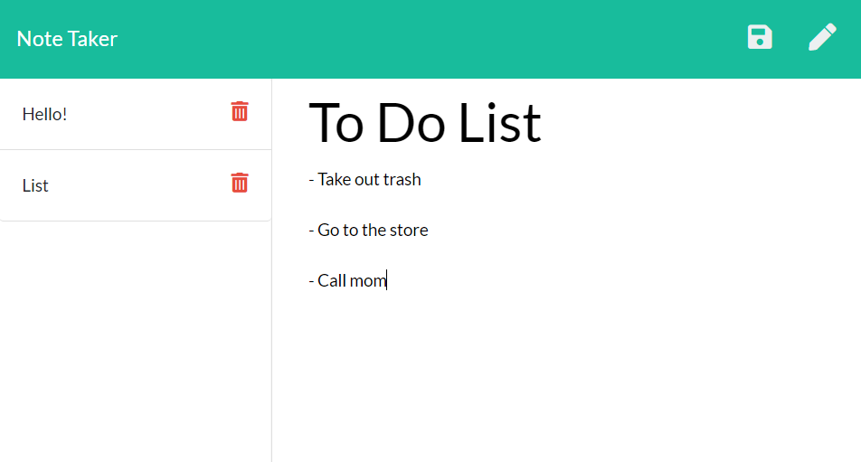

## Description

This application creates and saves notes, allows you to view previously created notes, and deletes notes. This application will use an express backend and save and retrieve note data from a JSON file.

## User Story

```
AS A user, I want to be able to write and save notes

I WANT to be able to delete notes I've written before

SO THAT I can organize my thoughts and keep track of tasks I need to complete
```

## Application



[Deployed Link]

## Deploying the App

You will not be able to deploy your server side code on GitHub pages. This app should be deployed on Heroku. Carefully follow the [Heroku Guide](../04-Supplemental/HerokuGuide.md) for getting your app deployed on Heroku.


## Submission on BCS

You are required to submit the following:

* The URL of the deployed application. This should be the link to the url provided by Heroku. Be sure not to submit a link to the Heroku dashboard.

* The URL of the GitHub repository
